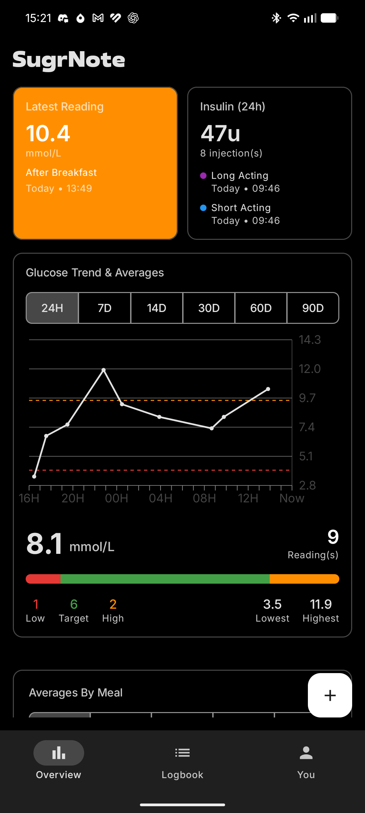
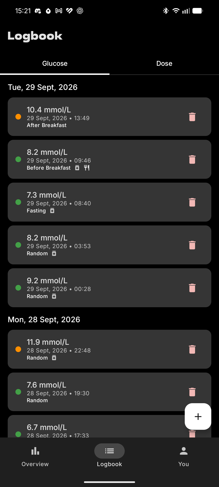
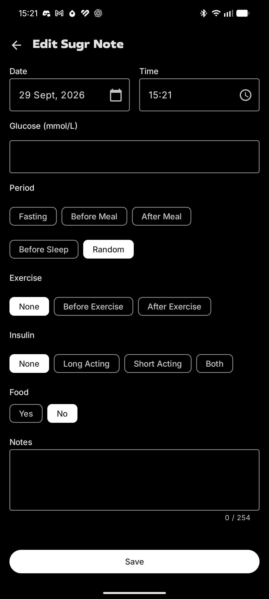

# SugrNote

> **A modern, offline-first Android companion for logging, tracking, and understanding your blood glucose, insulin doses, carbs, and daily trends.**

[](https://developer.android.com)
[](https://kotlinlang.org)
[](https://developer.android.com/jetpack/compose)
[](https://developer.android.com/training/data-storage/room)
[](https://developer.android.com/topic/libraries/architecture/datastore)
[](https://www.apache.org/licenses/LICENSE-2.0)

---

## About SugrNote

SugrNote is a simple personal diabetes management companion built to make daily tracking effortless, informative, and private. It gives you a clear picture of how food, insulin, and activity affect your glucose levels over time.

---

## 📱 Screenshots

| Overview Dashboard | Logbook History | Add / Edit Entry |
| :---: | :---: | :---: |
|  |  |  |

---

## What SugrNote Does

### 🩸 Fast & Reliable Glucose Logging

Log your blood sugar in seconds with clear contextual tags, including Fasting, Before or After Meals (Breakfast, Lunch, Dinner, Snack), Bedtime, and Random checks. SugrNote supports both **mg/dL** and **mmol/L** with automatic conversion, guards against accidental typo values, and lets you attach personal notes to any reading.

### 💉 Comprehensive Insulin Tracking

Easily record Long-Acting (basal) and Short-Acting (bolus) insulin doses. An interactive 24-hour summary card aggregates your recent intake and injection counts, while multi-week averages (7 to 90 days) help you spot dosing trends over time.

### 🥗 Nutrition & Physical Activity

Keep track of carbohydrate intake in grams directly linked to your meals and insulin doses. You can also log exercise timing (before or after workouts), duration, and intensity to see firsthand how exercise shapes your glycemic response.

### 📊 Trends, Averages & Time-in-Range (TIR)

Understand your health patterns at a glance. An interactive trend chart lets you explore raw 24-hour readings or review hourly averages across 7, 14, 30, 60, or 90 days. A visual Time-in-Range bar clearly displays the proportion of readings that fall within your target, low, or high zones, accompanied by mealtime breakdowns.

### 📖 Dual-View Logbook

Browse your complete history organized chronologically by day. Switch seamlessly between a **Glucose view** with color-coded status badges and an **Insulin Dose view** that summarizes total daily units and mealtime carbs. Every entry can be edited or deleted with safety confirmations.

### 🔔 Live Notification & Home Screen Widget

Stay connected to your latest reading without opening the app. A persistent, color-coded notification in your status shade reflects your current glycemic range (green for in-range, red for low, amber for high). A glanceable home screen widget provides an instant snapshot and a one-tap shortcut to log new readings on the go.

### 🎨 Personalization

Customize your target blood glucose thresholds, choose between 12-hour and 24-hour clocks, select your preferred date format, and switch between Light, Dark, or battery-friendly OLED true-black themes.

### 🔒 Offline-first

All data is stored exclusively on your device in a local database.

---

## Application Structure

SugrNote is organized into four main areas:

- **Overview**: Your health dashboard featuring the latest reading hero card, 24-hour insulin intake, interactive trend graphs, Time-in-Range statistics, and mealtime averages.
- **Logbook**: A chronological diary with dedicated tabs for Glucose readings and Insulin doses.
- **Entry Form**: A clean, unified form for quickly logging blood sugar, meal periods, insulin units, carbs, exercise, and notes.
- **You & Settings**: Personal preferences for units (mg/dL vs. mmol/L), target thresholds, date and time styles, and appearance themes.

---

## Upcoming Roadmap

Upcoming development priorities are documented in detail in **[docs/roadmap.md](docs/roadmap.md)**:

- **Carb-to-Insulin Ratio (CIR) Calculator & Bolus Advisor**
- **Medical Reports & Data Export**
- **Smart Reminders**

---

## Architecture & Tech Stack

SugrNote is built following modern Android best practices using Kotlin and Jetpack Compose for a reactive, single-activity user interface. It utilizes Clean Architecture with MVVM, Coroutines, and StateFlow for unidirectional data flow. Persistence is handled on-device using a Room SQLite database and Jetpack DataStore Preferences. It targets Android SDK 36 with a minimum compatibility of Android 11 (API 30).

Detailed technical documentation and database schemas are available in **[docs/README.md](docs/README.md)**.

---

## 📥 Getting Started

### Prerequisites

- Android Studio Ladybug (2024.2+) or newer
- Android SDK 36 (Java 17)

### Build & Run

```bash
# Clone the repository
git clone https://github.com/kmuchiri/SugrNote.git
cd SugrNote/app

# Build debug APK
./gradlew assembleDebug

# Run tests
./gradlew testDebugUnitTest
```

---

## 📄 License

This project is licensed under the [Apache License 2.0](https://www.apache.org/licenses/LICENSE-2.0).
